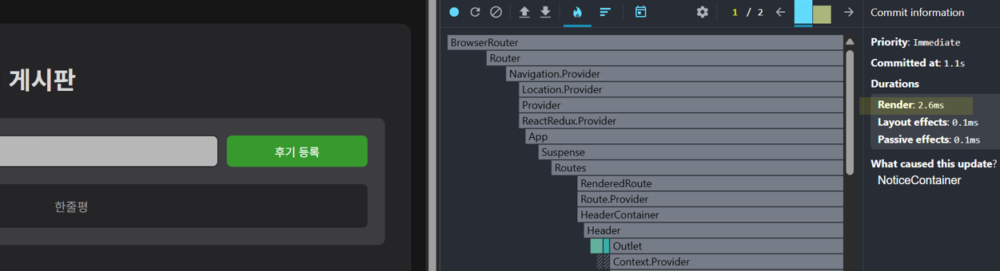

# 🥪 1인 가구를 위한 편의점 조합 레시피 추천 웹앱

## ✨ 프로젝트 기획 의도

> **“편의점 조합으로 간편하고 즐거운 식사를”**

1인 가구의 증가와 함께 **간편한 식사**에 대한 수요가 높아지고 있지만, 기존 레시피 서비스는 대부분 집밥이나 정식 위주입니다.  
편의점 식재료를 활용한 **간편 레시피**는 찾기 어렵고, 사용자 맞춤형 추천 기능도 부족합니다.

그래서 저희는 다음과 같은 기능을 갖춘 웹앱을 기획했습니다:

- ✅ **랜덤 레시피 추천**
- ✅ **사용자 맞춤형 조합 공유 및 소통 (게시판)**
- ✅ **Kakao Map API를 활용한 편의점 위치 안내**

> 혼밥도, 혼요리도 더 이상 어렵지 않도록!  
> **편의점 식재료로 만들 수 있는 다양한 조합 레시피**를 제안합니다.

---

## 👨‍👩‍👧‍👦 팀원 & 역할 분담

| 이름       | 역할                                                                    |
| ---------- | ----------------------------------------------------------------------- |
| **전하성** | 더미 데이터 생성<br>게시판 CRUD<br>무한 스크롤                          |
| **윤요엘** | 전체 UI/UX 설계<br>SPA 구성 (Router, Lazy, Suspense)<br>마이페이지 구현 |
| **김민식** | 외부 API 연동<br>편의점 위치 안내 화면 구현 (Kakao Map API)             |

---

## 📝 협업 증빙 (Notion)

> 팀원들과의 협업 및 기획 내용은 아래 노션 페이지를 통해 확인할 수 있습니다:

🔗 [김민식](https://www.notion.so/292fc6992fc580868fbfdaba3414ec34)  
_(해당 링크는 협업 증거 제출용입니다.)_

---

## 🛠️ 핵심 기능

| 기능                 | 설명                                           |
| -------------------- | ---------------------------------------------- |
| **📌 CRUD**          | 게시글 생성 / 조회 / 수정 / 삭제 전부 구현     |
| **🚀 SPA + 라우터**  | React Router 기반의 단일 페이지 어플리케이션   |
| **🌀 가상 스크롤**   | 무한 스크롤을 통해 데이터 효율적 처리          |
| **🧩 코드 스플리팅** | React `lazy` + `Suspense` 활용                 |
| **🗺️ 외부 API 연동** | Kakao Map API 사용 (주변 편의점 위치 안내)     |
| **📱 반응형 웹**     | PC / 태블릿 / 모바일 대응 UI                   |
| **🧠 상태 관리**     | Redux                                          |
| **⚙️ 성능 최적화**   | `React.memo`를 사용한 컴포넌트 리렌더링 최적화 |

---

## 📦 기술 스택

- **Frontend:** React, Redux, React Router, Styled-components, Sass
- **API 연동:** Kakao Map API
- **성능 최적화:** React.memo, lazy loading, Suspense
- **기타:** 가상 스크롤, 반응형 웹, SPA 구조

---

## 🛠️ 사용 라이브러리 및 버전

```json
{
  "axios": "^1.12.2",
  "classnames": "^2.5.1",
  "react-icons": "^5.5.0",
  "react-redux": "^9.2.0",
  "react-router-dom": "^7.9.4",
  "react-virtualized": "^9.22.6",
  "redux": "^5.0.1",
  "redux-devtools-extension": "^2.13.9",
  "sass": "^1.93.2",
  "styled-components": "^6.1.19",
  "web-vitals": "^2.1.0"
}
```

## ⚡ 성능 최적화

본 프로젝트에서는 사용자 경험 개선을 위해 다양한 성능 최적화 기법을 적용하였습니다:

- **React.memo**를 활용하여 불필요한 컴포넌트 리렌더링을 최소화하였습니다.
- **React.lazy**와 **Suspense**를 통해 코드 스플리팅을 적용, 초기 로딩 속도를 개선하였습니다.
- Redux 상태 관리 최적화를 통해 효율적인 상태 업데이트를 구현하였습니다.
- 각 container 컴포넌트 내 **dispatch 함수에 useCallback**을 적용해 렌더링 성능을 향상시켰습니다.
- 무한 스크롤 기능 도입으로 대용량 데이터도 부드럽게 처리할 수 있도록 하였습니다.

---

### 최적화 전후 성능 비교

#### 1. 기본 속도

  
_초기 구현 상태에서의 렌더링 소요 시간_

#### 2. React.memo 적용 후

  
_React.memo를 활용해 불필요한 리렌더링을 줄인 후의 성능_

#### 3. React.memo + 무한 스크롤 적용 후

  
_무한 스크롤 기능 도입 후 대용량 데이터 처리 시 렌더링 시간 개선_

---

> 각 이미지는 페이지 렌더링 시 소요된 경과 시간을 측정한 결과입니다.  
> 최적화 적용 후 렌더링 속도가 눈에 띄게 개선된 것을 확인할 수 있습니다.

---

## 📌 프로젝트 흐름 & UI

> 아래는 프로젝트의 주요 기능 흐름과 각 페이지 UI를 시각화한 자료입니다.  
> 플로우차트, 시연 GIF, 스크린샷 등을 통해 사용자 경험을 미리 확인할 수 있습니다.

---

### 🏠 메인 페이지 (랜덤 레시피 추천)

- 사용자가 웹사이트에 접속하면 가장 먼저 보게 되는 페이지입니다.
- 랜덤으로 편의점 재료 기반 레시피 조합을 추천받을 수 있습니다.

#### 🔁 Flowchart


#### 🖼️ 스크린샷 (PC)


#### 🖼️ 스크린샷 (모바일)


---

### 🧠 Redux 상태 관리 흐름

- 게시판, 사용자, 레시피 등 주요 데이터는 Redux를 통해 전역 상태로 관리됩니다.
- API 호출 등은 컴포넌트 내부에서 수행하며, 처리 결과를 Redux 액션으로 전달해 상태를 갱신합니다
- 상태 흐름을 시각화하여 전체 데이터 구조를 쉽게 이해할 수 있도록 했습니다.

#### 🔁 Redux 데이터 흐름도


#### 🎬 시연 GIF


---

### 📝 게시판 (레시피 조합 공유)

- 사용자들이 자신만의 편의점 조합 레시피를 공유할 수 있는 공간입니다.
- CRUD 기능이 구현되어 있어 작성/조회/수정/삭제가 가능합니다.

#### 🔁 Flowchart


#### 🎬 시연 GIF


#### 🖼️ 스크린샷 (모바일)


---

### 🗺️ 후기 작성 및 편의점 위치 안내 (Kakao Map API)

- Kakao Map API를 활용해 사용자 주변의 편의점을 확인할 수 있습니다.
- 지도 기반 UI를 통해 편의점 이름, 위치 정보 등을 제공합니다.
- 사용자들이 방문한 편의점에 대해 후기를 작성하고 공유할 수 있는 기능도 포함되어 있습니다.

#### 🔁 Flowchart


#### 🎬 시연 GIF


#### 🖼️ 스크린샷 (모바일)


---

### 🙍 마이페이지

- 사용자가 작성한 게시글을 모아보고 관리할 수 있는 공간입니다.
- 반응형 UI로 구성되어 있어 모바일/PC 모두 대응합니다.

#### 🔁 Flowchart


#### 🎬 시연 GIF


#### 🖼️ 스크린샷 (모바일)


---

## 🙌 마무리

이 프로젝트는 혼밥족을 위한 소소하지만 유용한 시도를 담은 웹앱입니다.  
단순히 레시피를 보여주는 것을 넘어, 사용자와 소통하고 실제로 활용 가능한 조합을 추천하며,  
편의점이라는 친근한 환경을 기반으로 한 실용적인 서비스를 제공하는 것을 목표로 하고 있습니다.

앞으로도 다양한 기능 개선과 확장 가능성을 염두에 두고 있으며,  
사용자 맞춤형 편의점 조합 추천 플랫폼으로 발전할 수 있는 잠재력을 지닌 프로젝트입니다. 😊
